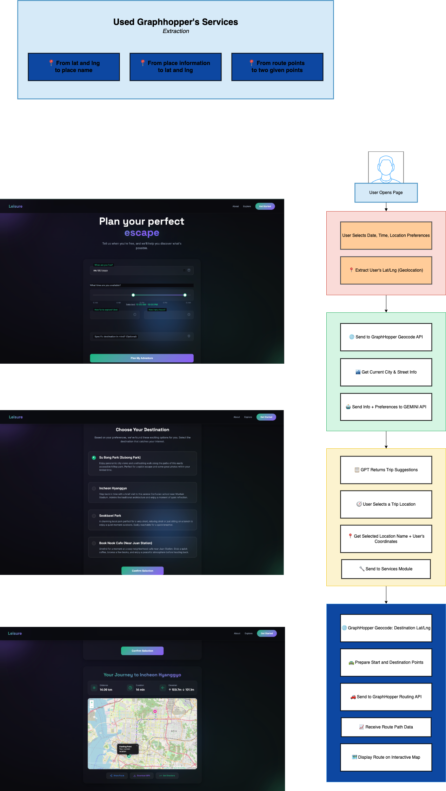
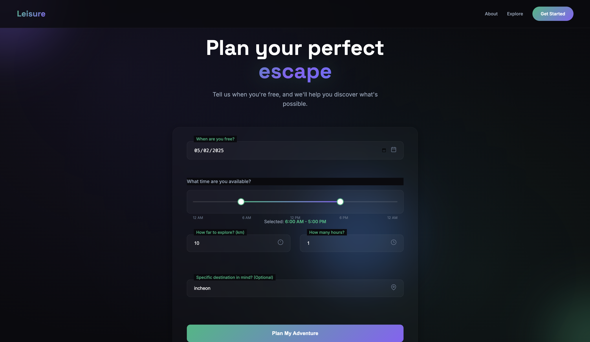

# Leisure - Discover Your Next Adventure

Leisure is an interactive web application that helps users discover and plan activities based on their available time and preferences. The application uses geolocation to find nearby attractions and provides detailed routing information to help users navigate to their chosen destinations.

## Overview

Leisure solves the common problem of "What should I do today?" by suggesting personalized leisure activities based on:
- Date and time availability
- How far you're willing to travel
- How much time you have available
- Optional specific destination preferences

## Video Preview


## Core Technologies

### FastAPI Backend

Leisure is built on FastAPI, a modern, high-performance web framework for building APIs with Python. Key features used:

- **Dependency Injection**: For handling user data and location information
- **Pydantic Models**: For request/response validation with models like `UserData` and `Location`
- **Async Support**: For efficient API calls to external services
- **Path Operations**: Organized API endpoints for handling user data and route calculations

### Gemini LLM Integration

The application uses Google's Gemini LLM (Large Language Model) to generate personalized leisure recommendations:

- **Context-Aware Suggestions**: Analyzes user preferences, time constraints, and current location
- **JSON Response Formatting**: Processes responses to provide structured location data
- **Natural Language Descriptions**: Generates appealing descriptions of each location
- **Prompt Engineering**: Carefully crafted prompts to produce relevant and realistic recommendations

### GraphHopper Routing API

For route calculations and geospatial features, Leisure integrates with GraphHopper:

- **Geocoding**: Converts place names to coordinates and reverse geocodes user locations
- **Route Calculation**: Determines optimal routes between user and suggested destinations
- **Distance & Duration Estimation**: Provides accurate travel metrics
- **Elevation Data**: Includes terrain information for more detailed route planning

## User Flow

1. **Input Preferences**: Users specify their available date, time range, maximum travel distance, and duration
2. **Discover Options**: The application suggests personalized destinations based on the user's criteria
3. **Select Destination**: Users choose from the suggested locations
4. **View Route**: Detailed route information, including distance, duration, and an interactive map is displayed
5. **Navigate or Share**: Users can get directions, download route information, or share their plans

## API Integration Flow



1. User submits location and preferences via FastAPI endpoint
2. The backend retrieves user's location context via GraphHopper reverse geocoding
3. User data and location context are formatted into a prompt for Gemini LLM
4. Gemini generates location suggestions based on the contextual data
5. User selects a destination from the suggestions
6. GraphHopper calculates the optimal route between user and destination
7. Results are displayed to user with interactive map visualization

## Technology Details

### FastAPI Implementation

```python
# User data endpoint
@router.post("/user-data/", response_model=dict)
def handle_input(data: UserData, location: Location):
    # Get user's address from coordinates
    address = reverse_geocode(location.lat, location.lng)
    if address:
        address = Place(**address)
    
    # Generate location suggestions with Gemini
    generated_locations = generate_locations(data, address)
    return {"locations": generated_locations}

# Route calculation endpoint
@router.post("/user-road/", response_model=dict)
def handle_input(selected: PlaceSelected):
    # Get route information from GraphHopper
    trip_info = get_trip_info(selected.lat, selected.lng, selected.name)
    return trip_info
```

### Gemini LLM Integration

```python
def generate_locations(data: UserData, address: Place):
    # Structured prompt template with user data
    prompt = Template("""
    You are an intelligent location recommender for short leisure trips.
    A user has submitted their availability and preferences...
    
    Date: $date
    Distance: $distance_km km
    Duration: $duration_hours hours
    Preferred destination: $destination
    Start time: $start
    End time: $end
    Current street: $street
    Current city: $city
    Current country: $country
    """)
    
    # Generate content with Gemini API
    genai.configure(api_key=os.environ.get("GOOGLE_API_KEY"))
    model = genai.GenerativeModel("gemini-2.5-pro-exp-03-25")
    response = model.generate_content(prompt)
    
    # Parse results to structured format
    return parse_json_response(response.text)
```

### GraphHopper API Integration

```python
def get_trip_info(lat, lng, destination_name):
    # Convert destination name to coordinates
    dest_coords = _get_coordinates(destination_name)
    
    # Calculate detailed route
    route_data = _get_route((lat, lng), dest_coords)
    return route_data

def _get_route(start, end):
    # Build GraphHopper API request
    route_url = "https://graphhopper.com/api/1/route?"
    response = requests.get(
        route_url + urllib.parse.urlencode({
            "key": os.getenv("GRAPH_HOPPER_API_KEY"),
            "profile": "car",
            "locale": "en",
            "points_encoded": "false",
        }) + 
        f"&point={start[0]},{start[1]}" +
        f"&point={end[0]},{end[1]}"
    )
    return response.json()
```

## Screenshots

### User Input Form

*The main form where users enter their availability and preferences*

### Location Selection

*The application suggests personalized options based on user input*

### Route Map Display

*Interactive map showing the route to the selected destination*

## Features

- **Responsive Design**: Works seamlessly on both desktop and mobile devices
- **Interactive Time Selector**: Visual slider for selecting available time ranges
- **Location Discovery**: AI-powered suggestions based on user preferences
- **Interactive Map**: Detailed routing with distance markers and elevation data
- **Sharing Options**: Easy sharing of route information with others

## Local Development

### Prerequisites
- Python 3.8+
- GraphHopper API key
- Google API key with Gemini access
- Node.js (for Vercel CLI if deploying)

### Installation

1. Clone the repository:
